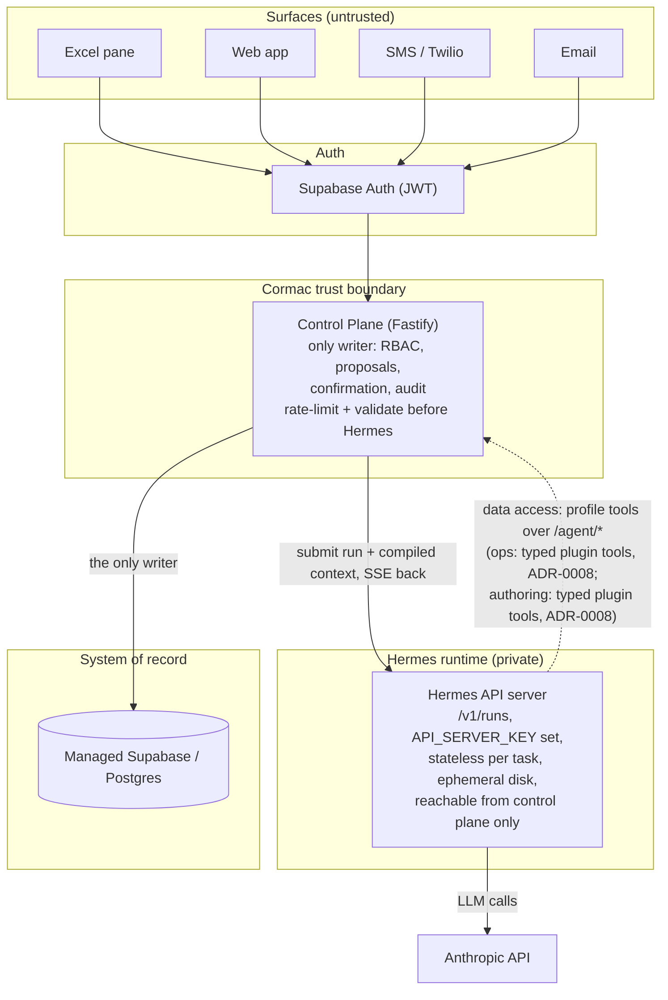

# Architecture

How Cormac v2 is structured. This is the current shape as of 2026-07-13: the authoring
and operations agents (ADR-0004/ADR-0008), the control plane, the v2 schema, the runtime
module, and the first client surface (`apps/web`, ADR-0010/0014) exist; deployment does
not (kind rehearsal deferred to the pilot track, #68). Diagrams
originated in the June 2026 post-archive sessions (formerly `v2-architecture/diagrams1.md`).

## The product

## Components

- **Control plane** (Node/TypeScript, Fastify): tenant routing, RBAC, contract publishing,
  the capture/proposal/confirm/apply/audit pipeline, connector webhooks, every write. The
  v0 implementations of the pipeline (atomic apply RPC, append-only audit, RLS isolation,
  JWKS auth) were proven live and are the porting reference under `archive/apps/api`.
- **Hermes runtime**: two agent roles over one runtime. The **authoring agent** (the
  keystone; interviews a client over their real workbook, produces the contract) and the
  **operations agent** (daily capture into proposals). Driven via the API server:
  `/v1/responses` with named conversations for interactive multi-turn (authoring),
  `/v1/runs` + SSE + the approval endpoint for gated work. Compiled, cache-stable
  workspace context rides the `instructions` seam. Transport pattern is live-proven in the
  sibling Jarvis project (see `.jarvis/research/jarvis-project-digest.md`).
- **Contract + knowledge layer**: published versioned contract per workspace; typed
  governed learning (record-bound aliases, enum synonyms) behind a review gate; compiled
  into the cached prefix. Prose memory rejected by design. Date/datetime fields may carry
  an optional `semantic` tag (`last_touch` | `follow_up`), so surfaces and agents act on
  attention meaning without hardcoded column names (drives the Book's "what needs you
  today" greeting, chips, and default ordering; the authoring interview elicits it, and
  the ops agent may keep a `last_touch`-tagged field current).
- **System of record**: managed Supabase/Postgres, JSONB-hybrid with generated hot
  columns, RLS, ES256/JWKS.
- **Web surface** (`apps/web`): Vite + React 19 + Tailwind v4 on shadcn/ui primitives;
  talks only to the control plane's `/api/*` with Supabase-issued JWTs. Supabase Auth is
  the sole sign-in broker (password today; magic link and Microsoft/Google OAuth via
  PKCE ride the open #79→#91 train, so the control plane needs zero auth changes per
  provider). Workbook parsing happens in the browser; only the detection profile
  (structure plus limited sample values) is uploaded. Governed spreadsheet view (ADR-0014,
  amending ADR-0010 point 3): an editable grid over the record store, beside the agent, whose
  cell edits stage and commit through the pipeline (never direct-to-DB) and which is a view, not
  a copy or two-way mirror of the client's Excel. The governed grid is realized as **the
  Book**: one fused workspace, the grid beside a single Cormac conversation panel, presented
  at every stage of a workspace's life (pre-live it is the workbook upload plus the authoring
  interview; at publish the workbook becomes the live grid). Navigation is flat (Book,
  History, Structure, People); setup is a phase of the Book, not a separate page. Agent
  proposals arrive as messages in the Cormac panel with in-grid diffs and per-change
  approve / adjust-in-grid / reject (#114). The panel's live conversation is a read view over
  the pipeline's own tables (server truth), not browser-local state.

## Data-access seam (settled for both agents)

Both agents reach data through the control plane's `/agent/*` API; the seam question was
only ever how a tool call leaves the model. For the **operations agent** it is settled
(ADR-0008): typed tools registered by the per-profile `cormac-ops` plugin
(`evals/ops-capture/plugin/`), handlers making stateless HTTP calls — no shell, no MCP
callback, no connection state. The ops profile is locked down to exactly those three
tools, with memory, user profile, and curator off, and its whole procedure in SOUL.md
(no skills toolset). The **authoring agent** now runs the same shape (ADR-0008, landed
2026-07-08, PR #75): a typed `cormac-authoring` plugin (`read_workbook`,
`submit_contract`) over `/agent/*`, terminal and all default toolsets off. It **keeps**
the skills toolset — the interview is a skill — and neutralizes self-modification with
`curator.enabled false` + `skills.write_approval true` + `skills opt-out --remove`,
where the injection-facing ops agent takes the stronger posture of disabling skills
entirely. The write gate stays a schema-enforced
proposal either way; the boundary is authority (credentials, RLS, the validated gate),
not transport. Evidence: `.jarvis/research/ops-seam-findings.md` and
`.jarvis/research/authoring-spike-findings.md`.

Bundled tools authenticate to the control plane's `/agent/*` surface with
workspace-scoped agent tokens: hashed at rest, revocable, per-agent-kind privilege
split (ADR-0005). Infisical holds the only copy of every secret; the gateway launches
under `infisical run` (`pnpm agent:hub run`) so credentials reach Hermes and its tool
subprocesses as injected process env, never through a file (ADR-0005 as amended
2026-07-08). Billing and model ride the ADR-0006 environment (ADR-0007): `dev` = gpt-5.5
on the Codex OAuth plan (cheap iteration), `staging` = metered Sonnet 4.6 (the only
source of cost and behavior evidence).

## Environments

One Supabase project per tier, with the Infisical environment slug as the single switch
(ADR-0006): `dev` = the local CLI stack (tests, everyday dev), `staging` = the managed
project (remote proofs, later the deployment rehearsal target), `prod` = reserved for the
production project at deployment time. `APP_ENV` rides in each vault environment, so the
prod auth posture flips with the environment, never by hand.

## Deployment shape

Plain OCI images + Helm charts; local proof on a kind rehearsal cluster (mkcert TLS,
`*.localtest.me`, ESO + Infisical, ArgoCD optional) mapping one-to-one to EKS. Juno is a
dev substrate only (ADR-0003). The v0 rehearsal scripts under `archive/scripts/kind/` are
the porting reference.

## Development plane (not product)

This repo is PM-managed by the Jarvis instance `jarvis-cormac` (port 8643); see
`AGENTS.md`. Jarvis is developer tooling, never a product component.
