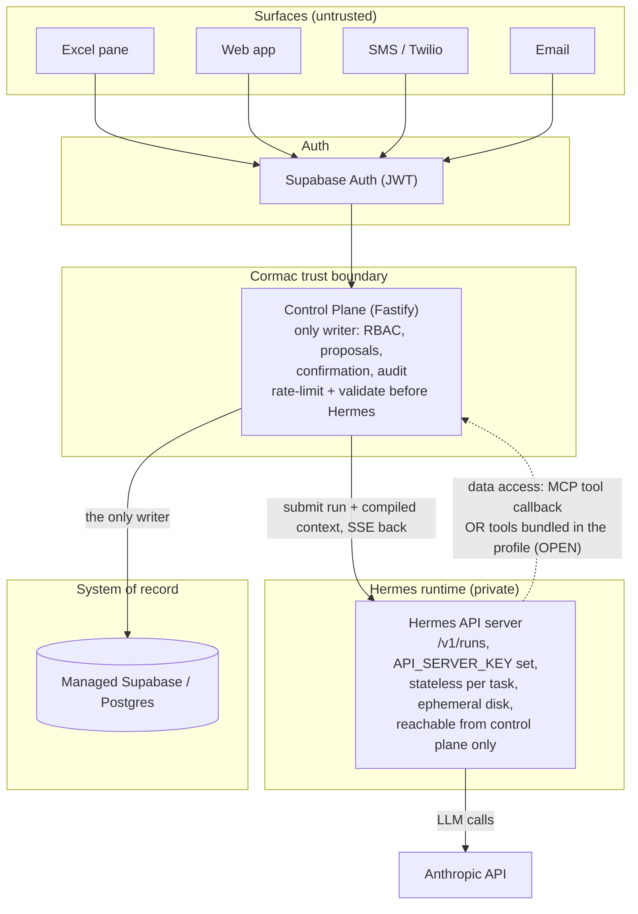

# Architecture

How Cormac v2 is structured. This is the target shape; as of 2026-07-07 none of it is
built. The one deliberately open seam is marked OPEN. Diagrams originated in the June 2026
post-archive sessions (formerly `v2-architecture/diagrams1.md`).

## The product

## Components

- **Control plane** (Node/TypeScript, Fastify): tenant routing, RBAC, contract publishing,
  the capture/proposal/confirm/apply/audit pipeline, connector webhooks, every write. The
  v0 implementations of the pipeline (atomic apply RPC, append-only audit, RLS isolation,
  JWKS auth) were proven live and are the porting reference under `archive/apps/api`.
- **Hermes runtime**: two agent roles over one runtime. The **authoring agent** (the
  keystone; interviews a client over their real workbook, produces the contract) and the
  **operations agent** (daily capture into proposals). Driven via the API server:
  `/v1/responses` with named conversations for interactive multi-turn (authoring),
  `/v1/runs` + SSE + the approval endpoint for gated work. Compiled, cache-stable
  workspace context rides the `instructions` seam. Transport pattern is live-proven in the
  sibling Jarvis project (see `.jarvis/research/jarvis-project-digest.md`).
- **Contract + knowledge layer**: published versioned contract per workspace; typed
  governed learning (record-bound aliases, enum synonyms) behind a review gate; compiled
  into the cached prefix. Prose memory rejected by design.
- **System of record**: managed Supabase/Postgres, JSONB-hybrid with generated hot
  columns, RLS, ES256/JWKS.

## OPEN seam (first decision of the keystone spike)

Agent data access during a run: **tools bundled in the Hermes profile** vs **MCP tool
callback to the control plane**. The write gate stays a schema-enforced proposal either
way. v0's mistake was routing everything through MCP and calling that the trust boundary;
the boundary is authority (credentials, RLS, the validated gate), not transport.

## Deployment shape

Plain OCI images + Helm charts; local proof on a kind rehearsal cluster (mkcert TLS,
`*.localtest.me`, ESO + Infisical, ArgoCD optional) mapping one-to-one to EKS. Juno is a
dev substrate only (ADR-0003). The v0 rehearsal scripts under `archive/scripts/kind/` are
the porting reference.

## Development plane (not product)

This repo is PM-managed by the Jarvis instance `jarvis-cormac` (port 8643); see
`AGENTS.md`. Jarvis is developer tooling, never a product component.
