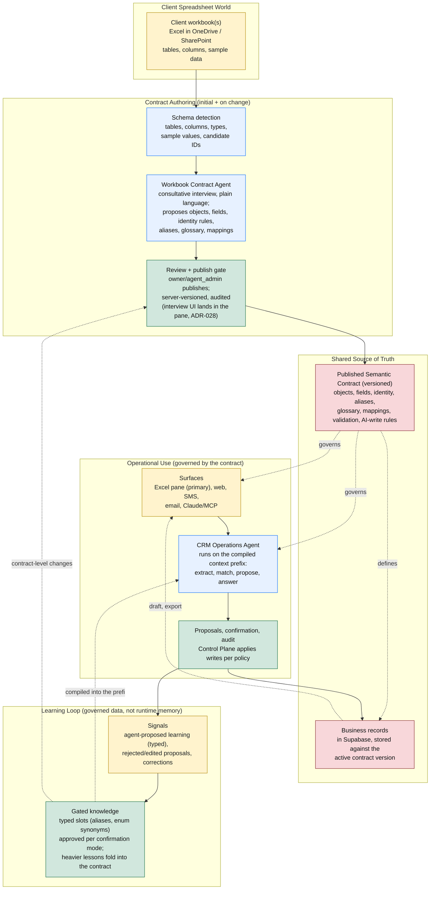

# Contract Model

> **Status:** canonical · **Last reviewed:** 2026-06-12

Companion to [architecture.md](architecture.md). That doc is the trust/topology view; this one is the data-and-knowledge view: how a client's existing spreadsheets become the system's shared source of truth, how the agent's working knowledge is governed, and how both are compiled into what the agent actually runs on.

The product does not bend a database to whatever spreadsheet a client already uses, and it does not force the client to abandon their spreadsheet for a generic CRM. Instead it lifts the client's workbook into a **published semantic contract**: a governed, versioned definition of their business objects, fields, identity rules, aliases, business glossary, and Excel mappings. That contract is the single shared source of truth. Every surface, the operations agent, and the stored records all read the active contract version, and nothing changes the contract except a reviewed, versioned publish. A raw spreadsheet describes *shape*; the contract adds the *semantics* (identity, disambiguation, vocabulary, which fields the agent may write, lifecycle) the agent needs to act safely.

Since the first version of this doc, the knowledge side went from design to built (ADR-027, issues #46-#50): the contract carries the glossary, typed learned knowledge accumulates behind a gate, and the control plane compiles all of it into a cached context prefix per run. Those mechanics are described here as they exist, with measured numbers.

## What Each Part Does

**Client spreadsheet world**

- **Client workbook(s)**: the spreadsheets the business already runs on, in Excel/OneDrive/SharePoint. The raw input, treated as untrusted. The client keeps living here; the system meets them in it rather than replacing it.

**Contract authoring (initial, and on change)**

- **Schema detection**: reads tables, columns, types, sample values, relationships, and candidate identifiers from the workbook. Mechanical, not yet semantic. Proven twice in the feasibility spike (one synthetic fixture, one built from the design partner's real workbook; [../research/workbook-contract-agent-spike.md](../research/workbook-contract-agent-spike.md)).
- **Workbook Contract Agent**: proposes a semantic contract from the detected schema through a consultative interview, not a fixed questionnaire: free-form conversation with fixed checkpoints (structure agreed, then fill, then review), asking in the client's own plain language, never in database terms. It can propose a better structure than the workbook brought. The engine is host-agnostic and in build (M2, #17/#37); its UI mounts in the Excel pane against the live open workbook (ADR-028, M4), where it can highlight the column it is asking about.
- **Review + publish gate**: a human with the `publish_contract` capability (owner or agent_admin) reviews and publishes. Publishing is atomic and server-authoritative: the control plane bumps the version (the document cannot claim its own), flips the single active flag, and writes the audit event in one transaction. Nothing takes effect until published. This is the only path that changes the contract, whether the change came from a new workbook or from distilled learning.

**Shared source of truth**

- **Published semantic contract (versioned)**: the governed definition the whole system runs on, including the **business glossary**: the workspace's own terms and definitions, optionally scoped to an object or field. The glossary lives inside the contract document deliberately (ADR-027): one knowledge artifact, one review gate, one version history, instead of a second governed document drifting beside the first. Every record, proposal, and audit event references the contract version that governed it.
- **Business records**: the actual CRM data in Supabase, stored against the active contract version. Object types come from the contract, not from hard-coded product tables.

**Operational use (governed by the contract)**

- **Surfaces**: the Excel task pane (primary, ADR-028), web, SMS, email, Claude/MCP. They read and present data through the contract and submit changes as proposals; they never write business records directly. The pane reads the client's open workbook through Office.js and relays; the contract-generated, validate-at-sync workbook of ADR-022 is the post-v1 shape of the Excel data surface (#29/#30), with the pane subsuming its interactive UX for the pilot.
- **CRM Operations Agent**: live (ADR-026). It runs on the compiled workspace context (next section) delivered in its prompt prefix, and acts only through the control plane's MCP tools. It extracts entities, matches them to existing records, proposes updates, answers questions, and proposes learning when it had to infer something.
- **Proposals, confirmation, audit**: the Control Plane validates proposed changes (Zod against the contract), then applies writes per the workspace confirmation setting (confirm-each, or opt-in apply-then-report fire-and-forget), and records an audit event. The runtime only proposes; the Control Plane is the only thing that writes.

**Learning loop (governed data, not runtime memory)**

Built (ADR-027). Two tiers, by weight:

- **Typed learned knowledge** is the day-to-day tier. The agent proposes into narrow typed slots via the `propose_learning` tool: an **alias** binds a string variant to one specific record ("the Hendersons" means person `abc-123`); an **enum synonym** maps a workspace word to a canonical field option ("hot lead" means status `active`). Each proposal is validated against the active contract at propose time, held in a `proposed` state, decided by a manager or above (the gate follows the workspace confirmation mode; the skeleton is confirm-each, so v1 holds everything for human approval), re-validated at approval, and only `active` rows ever reach the agent. Rows are deduplicated on a natural key, revocable (revocation frees the slot and takes effect at the next compile), and record-bound aliases are deleted with their record. There is no free-text memory slot and no autonomous compaction, deliberately: free text in the prefix is an injection surface and the published memory-poisoning results against agent memory were decisive (see [../research/workspace-knowledge-layer-design.md](../research/workspace-knowledge-layer-design.md)).
- **Contract-level learning** is the heavier tier: corrections that imply a new glossary entry, a sharper identity rule, or an eval case are distilled into a proposed contract change and go through the same review-and-publish gate as any contract edit.

The system gets smarter per workspace, and every lesson is an inspectable, versioned, revocable row. The weekly-report surface for what was learned lands with reporting (M7, #21).

## The compiled context: what the agent actually runs on

ADR-027 names five knowledge strata. All governed state lives in Postgres; none lives in the runtime:

| Stratum | Lives | Status |
| --- | --- | --- |
| Schema contract (objects, fields, identity, AI-write rules) | contract document, versioned | built |
| Business glossary | inside the contract document | built |
| Learned knowledge (typed slots) | `learned_knowledge` rows, gated lifecycle | built |
| Procedural skills (per-workspace instructions) | deferred by design | not before the authoring engine proves the need |
| Episodic history (messages, proposals, audits) | operational tables; reached by tools, never preloaded | built |

Per task, the control plane compiles the first three into one rendered block: active contract (glossary included) plus active learned rows, joined against live records at compile time (an alias whose record was archived renders nothing; canonical displays render through the existing redaction path, so sensitive values cannot leak into the prefix). The render is deterministic and byte-stable: fixed section order, codepoint sorts, normalized newlines, hostile content flattened to inert single-line data. Byte stability is not cosmetic; it is what makes the block cacheable.

The block is delivered through the runtime's run `instructions`, which Hermes appends inside its cached system block, so the agent starts every task already knowing the workspace instead of spending its first tool calls fetching it. `get_active_contract` remains available as a mid-run re-read tool, not a first step. Measured effect of the switch (ADR-026 baseline → ADR-027 posture): 5 model/tool calls per task down to 2-3, 21s down to 8-15s, ~$0.045 down to ~$0.03, with cross-run cache reuse proven (a warm run reads ~26k tokens from cache and writes none).

Two properties fall out of the gates feeding the compile:

- Nothing the agent infers reaches its own future context without passing a human-controlled gate (the publish gate or the learning decision).
- The "agent that knows your business" is an experience reconstructed per run from governed rows. There is no other place its knowledge can hide.

## Contract Rules

- The published contract is the single shared source of truth. Every surface, the operations agent, and stored records read the active version.
- We lift the spreadsheet into a governed contract; we do not bend the database to an arbitrary spreadsheet. Arbitrary bidirectional sync with any existing workbook is out of scope.
- App-owned operational tables (workspaces, users, roles, source messages, proposals, learned knowledge, audit events, and the contract itself) are fixed product structure. Business objects and fields come from the contract.
- Every object and field has a stable internal ID, independent of Excel labels or row/column positions. Contracts are versioned; records/proposals/audit reference the version that governed them.
- Publishing is server-authoritative and atomic: version bump, active flip, and audit in one transaction, behind the `publish_contract` capability. A contract document never decides its own version.
- The glossary is part of the contract, not a parallel artifact. One review gate and one version history cover both (ADR-027).
- The spreadsheet is a draft and work surface, never a direct writer. For the pilot, the pane mediates: Office.js reads the open workbook, every change goes through the proposal pipeline, and an approved write rendered back into the sheet is a surface action, not a writer. The contract-generated, validate-at-sync workbook (in-sheet dropdowns and typed validation as guidance, the Control Plane as the gate, off-contract rows becoming flagged proposals) is the post-v1 Excel data surface (ADR-022, #29/#30).
- Authoring a contract and doing day-to-day data work are different, differently-trusted steps. Managers and admins author or change the contract (the messy step, agent-assisted, publish-gated); regular users work the constrained surfaces. The messiness of a real spreadsheet is digested once at authoring (ADR-022, ADR-023).
- Learning lives as governed, reviewed data, never as opaque runtime memory (ADR-009, ADR-027). Typed slots only for autonomous proposals; no free-text memory; no autonomous compaction. Two vocabularies coexist and stay distinct: contract-level aliases are vocabulary about *kinds of things*, learned aliases bind strings to *one record each*; the renderer labels them separately.
- Contract changes are gated, reviewed, versioned, and audited; learned-knowledge changes are gated, decided, and audited. Both feed one compiled context, and nothing reaches that context any other way.
- A schema describes shape; the contract adds the semantics (identity, disambiguation, AI-write permission, lifecycle) the agent needs to act safely. Detection alone is never enough to publish.
