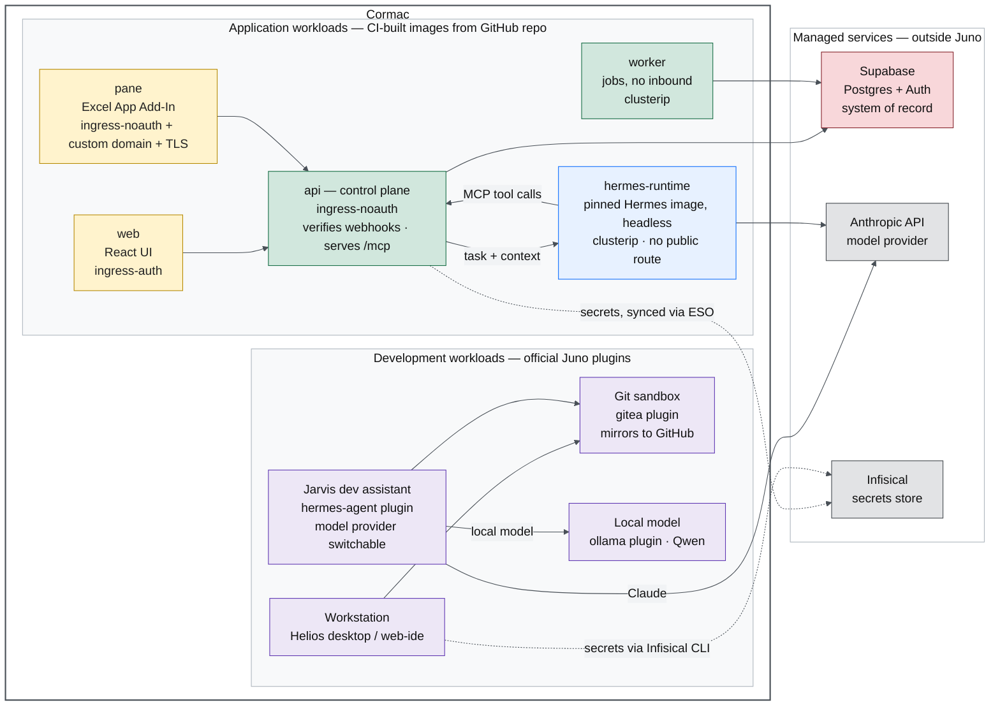

# CRM Agent (Cormac) + Juno pilot scope

Proposed Pilot Architecture

## 1. Dev workspace

A separate project where I write code and a dev-assistant agent helps me keep it organized. Every component is one of your official plugins, used as-is or lightly configured. The only custom part is my toolchain on the editor.

| Component | Juno plugin |
| --- | --- |
| Workstation (browser desktop, or editor) | `Workstations/helios`, or `web-ide` (code-server) |
| Dev assistant (Jarvis) | `hermes-agent` |
| Gitea | `gitea` |
| Local model (Qwen?) | `ollama` |

- **Note: The local model is a nice-to-have.** I'd run Qwen on `ollama` and keep Claude for the heavy thinking. A GPU slice for it would be great but isn't a blocker/requirement on day one.

### Open Questions: 
- What is the mechanism for getting the cli toolchain set up? (gh, pnpm, infisical, etc)
- How do the shared mount / durable volumes get organized, connect with the actual application (next)? 

## 2. Cormac app 

Here's what I have ready to bring to the onboarding: 

App is a pnpm monorepo, composed of a handful of normal containers, built from my own images by my CI on GitHub and pushed to GHCR as private images. My repo is a Terra Source. Each workload is a custom plugin (a Helm chart + terra.yaml) under plugins/<name>/ at the repo root. 

| Workload | Type | Network mode | Note |
| --- | --- | --- | --- |
| api | backend API — Node/Fastify | `ingress-noauth` | public; verifies its own webhooks; holds the secrets |
| web | web frontend — React/Vite | `ingress-auth` (or `ingress-noauth` for client previews) | the UI |
| worker | background worker — Node | `clusterip` | no inbound traffic |
| hermes-runtime | agent runtime — pinned upstream Hermes (Python) | `clusterip` | no public route; my own headless image, not the `hermes-agent` plugin |
| pane | web frontend — React/Vite | `ingress-noauth` + custom domain + cert-manager TLS | gated on a separate go/no-go; needs a stable domain |

- **Outside Juno:** (Workloads connect with these over the network.)
  - managed **Supabase** (the database, stays external, curious about a local dev workload though if a standard plugin exists)
  - **Anthropic** API
  - **Infisical** for secrets.

- **Secrets:** I keep my secret values in Infisical and have them land in the cluster as a normal Kubernetes Secret the containers read via secretKeyRef. Today I sync them from Infisical with the External Secrets Operator (it logs into Infisical with a read-only machine identity), and I can bring that whole setup. Is there a standard way you'd prefer secrets reach tenant containers on the pilot cluster?

### Open Questions:
- My images are private on GHCR, so the cluster needs an image-pull secret in the namespace, and it has to be present before the workloads sync. How would you like that seeded?

## General Diagram

