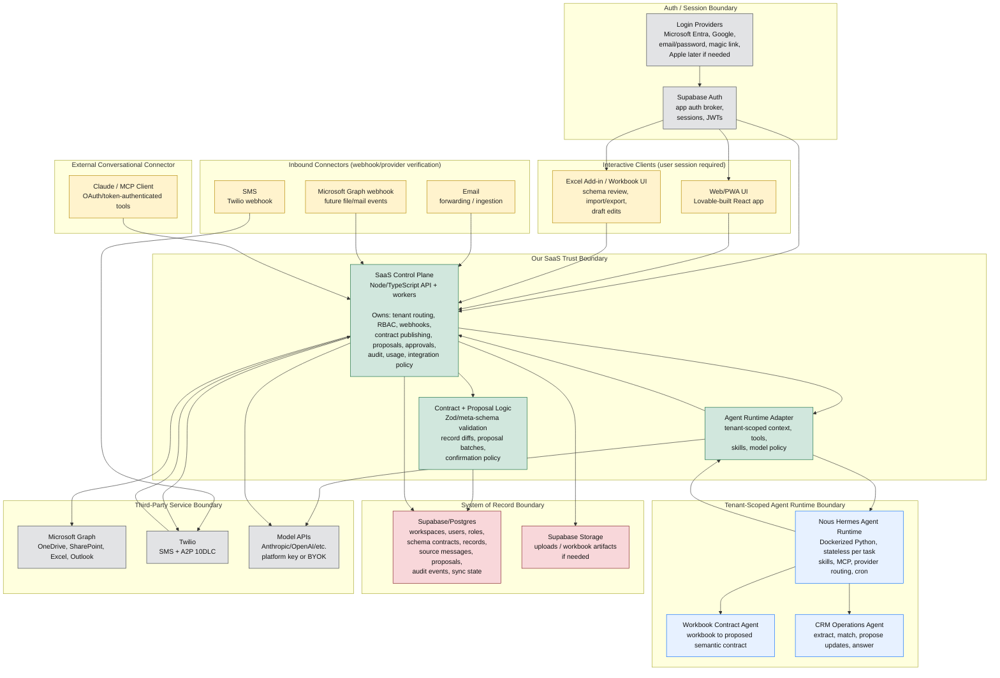

# High-Level Architecture

> **Status:** canonical · **Last reviewed:** 2026-06-06

This project should be understood as a multi-surface SaaS product with one governed backend trust layer. The web app, Excel, SMS, email, and Claude/MCP are all input/output surfaces; none of them owns business logic or writes directly to CRM data. Interactive clients authenticate through the app auth/session layer, while webhook-style connectors are verified by the SaaS Control Plane when requests arrive. The SaaS Control Plane enforces tenant boundaries, permissions, proposal and confirmation rules (including opt-in auto-apply), audit logging, and connector behavior before invoking the agent runtime or writing to Supabase.

This diagram is also the starting point for the client security packet. Each trust boundary below should eventually have supporting evidence in [../security/README.md](../security/README.md): tenant isolation, auth/RBAC, audit logging, secrets handling, AI data handling, Microsoft permissions, SMS compliance, backup/restore, and incident response.

## Primary Responsibilities

**Interactive clients**

- **Web/PWA**: primary control surface for records, review queue, workbook-contract wizard, admin, audit, integrations, and agent settings.
- **Excel add-in / workbook UI**: schema/data/work surface. Users can upload/select workbooks, import/export records, and later draft edits through an Excel add-in.

**Inbound connectors**

- **SMS**: quick capture, lightweight questions, reminders, and confirmations through Twilio webhooks. Trust comes from Twilio verification plus sender/workspace mapping, not an interactive login at message time.
- **Email**: forwarded-thread or shared-mailbox ingestion. Trust comes from controlled mailbox/address/token configuration and workspace mapping.
- **Microsoft Graph webhooks**: future file/mail/workbook events. Trust comes from Microsoft webhook validation and stored integration consent.

**External conversational connector**

- **Claude/MCP**: OAuth/token-authenticated external conversational surface that calls controlled tools, not raw database operations.

**Our code**

- **SaaS Control Plane**: the core backend. It verifies sessions, checks workspace membership/RBAC, handles connector webhooks, validates contracts, creates proposal batches, applies approved changes, writes audits, tracks usage, and decides what the runtime is allowed to do.
- **Contract + Proposal Logic**: validates semantic contracts and record changes. Zod should validate the meta-contracts and structured payloads; Supabase stores the active published contract and versions.
- **Agent Runtime Adapter**: prepares tenant-scoped context, skills, tools, model policy, and structured-output expectations before invoking the runtime.

**Runtime and data**

- **Nous Hermes Agent Runtime**: the adopted tenant-scoped agent execution runtime (Dockerized Python, run stateless per task, swappable behind the Agent Runtime Adapter). It runs two agent roles: the **Workbook Contract Agent** (turns a client workbook into a proposed semantic contract) and the **CRM Operations Agent** (extracts, matches, proposes record updates, and answers questions). It handles skills, MCP, provider routing, and scheduled work, but never owns tenant authority or canonical writes.
- **Supabase/Postgres**: source of truth for tenants, users, roles, schema contracts, business records, source messages, proposals, audit events, and sync state.
- **Supabase Auth**: handles app auth/session mechanics and can broker Microsoft, Google, email/password, magic link, and later Apple/social login providers. The Control Plane still owns authorization decisions.

**Trust rules**

- Surfaces never write directly to business records. The agent runtime never holds database write credentials and never mutates records directly.
- Writes are applied only by the Control Plane, after it validates the change against the contract, the user's permissions, and risk rules. Ambiguous or uncertain changes route to review even in apply-then-report mode (the agent flags uncertainty; per REQ-020/REQ-021). Whether that becomes a formal confidence score with a threshold is an open design question, not a settled mechanism.
- Auto-apply (fire-and-forget) is a supported, opt-in product behavior, not a hole in the trust model. For workspaces/users on apply-then-report, the Control Plane auto-applies validated agent-originated changes immediately, audits them, and includes them in the weekly report. Confirm-each mode instead waits for user approval. Either way the runtime only proposes; the Control Plane decides and applies.
- High-risk actions (schema/contract changes, deletes, bulk updates, permission changes) always require explicit confirmation, regardless of mode.
- Interactive clients authenticate through Supabase Auth/session JWTs.
- Inbound connectors are verified through provider signatures, tokens, sender identity, mailbox/workspace mapping, or Graph webhook validation.
- Supabase RLS/database constraints are a backstop, not a replacement for backend authorization.
- Microsoft Graph, Twilio, model APIs, and future MCP/Excel add-in paths are connectors controlled by the SaaS Control Plane.
- Microsoft login and Microsoft Graph access are separate concerns: a user can sign in with Microsoft without granting workbook, SharePoint, Outlook, or Excel permissions. Graph consent should happen only when the integration actually needs it.
