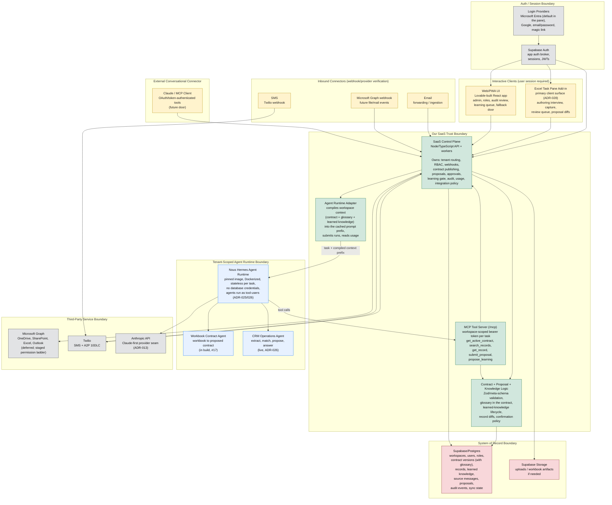

# High-Level Architecture

> **Status:** canonical · **Last reviewed:** 2026-06-12

This project should be understood as a multi-surface SaaS product with one governed backend trust layer. The Excel task pane, web app, SMS, email, and Claude/MCP are all input/output surfaces; none of them owns business logic or writes directly to CRM data. Interactive clients authenticate through the app auth/session layer, while webhook-style connectors are verified by the SaaS Control Plane when requests arrive. The SaaS Control Plane enforces tenant boundaries, permissions, proposal and confirmation rules (including opt-in auto-apply), audit logging, and connector behavior before invoking the agent runtime or writing to Supabase.

Two things changed since the first version of this diagram and are now reflected in it. First, the agent integration is real and has a precise shape (ADR-025/026): the runtime runs agents as tool-users that reach data only through an MCP tool server the control plane hosts, and a proposal is a schema-enforced tool call, never free-form output. Second, the Excel task pane add-in is the primary client surface and the web app is the admin, trust, and fallback door (ADR-028; build gated on the design phase and spike, see [../research/microsoft-ecosystem-integration.md](../research/microsoft-ecosystem-integration.md)).

This diagram is also the starting point for the client security packet. Each trust boundary below should eventually have supporting evidence in [../security/README.md](../security/README.md): tenant isolation, auth/RBAC, audit logging, secrets handling, AI data handling, Microsoft permissions, SMS compliance, backup/restore, and incident response.

## Primary Responsibilities

**Interactive clients**

- **Excel task pane add-in**: the primary client surface (ADR-028). One pane hosts both agent experiences: the authoring interview (the Workbook Contract Agent consulting against the client's open workbook, with range highlighting) and day-to-day operations (capture, review queue, proposal diffs). The pane is a thin web app we host on our own infrastructure; Office.js is its bridge to the open document. It renders and relays; it holds no business logic and no write authority. Build is gated on the ADR-028 design phase and spike.
- **Web/PWA**: the admin, trust, and fallback door. Role management, audit review, the learning queue, workspace settings, and the surface that always works when Microsoft is unavailable or a client lacks Excel. Capture and review stay feature-complete here as the platform-risk fallback.

**Inbound connectors**

- **SMS**: quick capture, lightweight questions, reminders, and confirmations through Twilio webhooks. Trust comes from Twilio verification plus sender/workspace mapping, not an interactive login at message time. Independent of Microsoft entirely.
- **Email**: forwarded-thread or shared-mailbox ingestion. Trust comes from controlled mailbox/address/token configuration and workspace mapping.
- **Microsoft Graph webhooks**: future file/mail/workbook events. Trust comes from Microsoft webhook validation and stored integration consent.

**External conversational connector**

- **Claude/MCP**: a future OAuth/token-authenticated external conversational surface that calls controlled tools, not raw database operations. Distinct from the internal MCP tool server below, which exists today and serves only our own runtime.

**Our code**

- **SaaS Control Plane**: the core backend. It verifies sessions, checks workspace membership/RBAC, handles connector webhooks, validates contracts, creates proposal batches, applies approved changes, gates learning, writes audits, tracks usage, and decides what the runtime is allowed to do.
- **Contract + Proposal + Knowledge Logic**: validates semantic contracts and record changes with Zod against the meta-schema. The contract carries the business glossary as part of the published, versioned document; learned knowledge (typed slots: aliases, enum synonyms) lives as governed rows with a proposal-style lifecycle (proposed, active, revoked) and is validated against the active contract at propose time and again at approval (ADR-027).
- **Agent Runtime Adapter**: compiles the workspace context (active contract, glossary, approved learned knowledge) into a byte-stable block delivered in the run's cached prompt prefix, submits runs to the runtime, and reads usage and cache metrics back (ADR-027). Nothing enters the prefix that has not passed the publish or learning gate.
- **MCP Tool Server**: the control plane's tool surface at `/mcp`, the only door the runtime has to tenant data. Each task gets a workspace-scoped bearer token, which is the tenant binding. Tools are thick verbs over the pipeline (`get_active_contract`, `search_records`, `get_record`, `submit_proposal`, `propose_learning`), never raw CRUD (ADR-007, ADR-025).

**Runtime and data**

- **Nous Hermes Agent Runtime**: the adopted agent execution runtime (pinned image, Dockerized, stateless per task, swappable behind the adapter). Agents run as tool-users: they read through the MCP tools and act by submitting schema-enforced tool calls; a proposal is a tool call, never parsed free text (ADR-025/026). The runtime holds no database credentials and no persistent memory; per-tenant knowledge reaches it only through the compiled prefix and the tools. It runs two agent roles: the **CRM Operations Agent** (live, proven end to end against real Postgres) and the **Workbook Contract Agent** (in build; the authoring pipeline, #17).
- **Supabase/Postgres**: source of truth for tenants, users, roles, contract versions (glossary included), business records, learned knowledge, source messages, proposals, audit events, and sync state.
- **Supabase Auth**: handles app auth/session mechanics and brokers external identity providers; the Control Plane still owns authorization decisions (ADR-011). In the Excel pane, Microsoft Entra sign-in brokered through Supabase is the intended default for the Microsoft-resident demographic (silent via NAA where available, dialog relay as fallback); the exact pane sign-in design is part of the ADR-028 design phase. Entra is an option, never a requirement. Workspace users key to linkable identities, not to a single credential row.

**Trust rules**

- Surfaces never write directly to business records. The agent runtime never holds database write credentials and never mutates records directly; its only write-shaped action is a schema-validated tool call into the control plane, which decides.
- The live Excel surface is contract-constrained and pane-mediated. The task pane reads the open workbook through Office.js and relays; every submitted change goes through the control plane's proposal pipeline, which validates against the contract before applying. When the pane executes an approved write back into the workbook via Office.js, that is a surface action rendering a decision already made and audited, not a new writer. In-sheet rules are guidance, not the gate (ADR-022). There is no save-event hook in the platform; capture triggers are change events plus explicit user gestures.
- Writes are applied only by the Control Plane, after it validates the change against the contract, the user's permissions, and risk rules. Ambiguous or uncertain changes route to review even in apply-then-report mode (the agent flags uncertainty; per REQ-020/REQ-021). Whether that becomes a formal confidence score with a threshold is an open design question, not a settled mechanism.
- Auto-apply (fire-and-forget) is a supported, opt-in product behavior, not a hole in the trust model. For workspaces/users on apply-then-report, the Control Plane auto-applies validated agent-originated changes immediately, audits them, and includes them in the weekly report. Confirm-each mode instead waits for user approval. Either way the runtime only proposes; the Control Plane decides and applies.
- Learning is governed data, never runtime memory (ADR-009, ADR-027). The agent may propose typed learning (`propose_learning`); proposals are held, reviewed under the workspace's confirmation mode, and only approved rows are compiled into the context prefix. Revocation removes them from the next compile. Nothing the agent infers reaches its own future context without passing the gate.
- High-risk actions (schema/contract changes, deletes, bulk updates, permission changes) always require explicit confirmation, regardless of mode.
- Interactive clients authenticate through Supabase Auth/session JWTs.
- Inbound connectors are verified through provider signatures, tokens, sender identity, mailbox/workspace mapping, or Graph webhook validation.
- Supabase RLS/database constraints are a backstop, not a replacement for backend authorization.
- Microsoft Graph, Twilio, the model API, and future MCP/Excel connector paths are controlled by the SaaS Control Plane. Graph permissions, when they arrive, climb a staged minimal-scope ladder starting from zero (the add-in needs no Graph permissions at all; see the research doc, section 6).
- Microsoft login and Microsoft Graph access are separate concerns: a user can sign in with Microsoft without granting workbook, SharePoint, Outlook, or Excel permissions. Graph consent happens only when an integration actually needs it.
