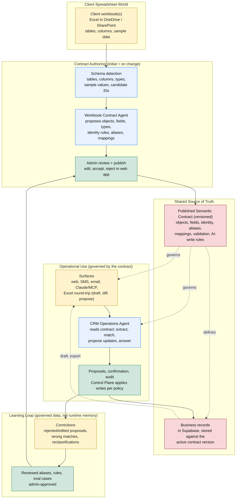

# Contract Model

> **Status:** canonical · **Last reviewed:** 2026-06-06

Companion to [architecture.md](architecture.md). That doc is the trust/topology view; this one is the data-and-contract view: how a client's existing spreadsheets become the system's shared source of truth, and how everything else is governed by it.

The product does not bend a database to whatever spreadsheet a client already uses, and it does not force the client to abandon their spreadsheet for a generic CRM. Instead it lifts the client's workbook into a **published semantic contract**: a governed, versioned definition of their business objects, fields, identity rules, aliases, and Excel mappings. That contract is the single shared source of truth. Every surface, the operations agent, and the stored records all read the active contract version, and nothing changes the contract except an admin-reviewed, versioned publish. A raw spreadsheet describes *shape*; the contract adds the *semantics* (identity, disambiguation, which fields the agent may write, lifecycle) the agent needs to act safely.

## What Each Part Does

**Client spreadsheet world**

- **Client workbook(s)**: the spreadsheets the business already runs on, in Excel/OneDrive/SharePoint. The raw input, treated as untrusted. The client keeps living here; the system meets them in it rather than replacing it.

**Contract authoring (initial, and on change)**

- **Schema detection**: reads tables, columns, types, sample values, relationships, and candidate identifiers from the workbook. Mechanical, not yet semantic.
- **Workbook Contract Agent**: proposes a semantic contract from the detected schema — objects, fields and types, identity rules, aliases/synonyms, relationships, Excel column mappings, and which fields the agent may write. This is the step that turns shape into meaning.
- **Admin review + publish**: a human edits, accepts, or rejects the proposed contract in the web app. Nothing takes effect until published. This is the only path that changes the contract.

**Shared source of truth**

- **Published semantic contract (versioned)**: the governed definition the whole system runs on. Stored in Supabase, versioned; every record, proposal, and audit event references the contract version that governed it.
- **Business records**: the actual CRM data in Supabase, stored against the active contract version. Object types come from the contract, not from hard-coded product tables.

**Operational use (governed by the contract)**

- **Surfaces**: web, SMS, email, Claude/MCP, and the Excel round-trip. They read and present data through the contract and submit changes as drafts; they never write business records directly. The live Excel surface is a workbook the system generates from the contract, with the contract baked in as native rules (dropdowns for enum fields, typed validation, locked structure, hidden stable IDs), so regular users work in real, live Excel that is clean by construction. Edits become a diff, then a proposal; in-sheet rules guide entry while the Control Plane validates every change against the contract at sync time (ADR-022).
- **CRM Operations Agent**: reads the active contract to extract entities, match them to existing records, propose updates, and answer questions. It operates inside the world the contract defines.
- **Proposals, confirmation, audit**: the Control Plane validates proposed changes (Zod against the contract), then applies writes per the workspace confirmation setting (confirm-each, or opt-in apply-then-report fire-and-forget), and records an audit event. The runtime only proposes; the Control Plane is the only thing that writes.

**Learning loop (governed data, not runtime memory)**

- **Corrections**: rejected or edited proposals, wrong-entity matches, reclassifications. Captured as structured signal, not as free-text agent memory.
- **Reviewed aliases, rules, eval cases**: corrections are distilled into proposed contract improvements (a new alias, a sharper identity rule, an eval case), admin-approved, and folded back in through the same review-and-publish gate. The system gets smarter per workspace, and every lesson is an inspectable, versioned artifact.

## Contract Rules

- The published contract is the single shared source of truth. Every surface, the operations agent, and stored records read the active version.
- We lift the spreadsheet into a governed contract; we do not bend the database to an arbitrary spreadsheet. Arbitrary bidirectional sync with any existing workbook is out of scope.
- App-owned operational tables (workspaces, users, roles, source messages, proposals, audit events, and the contract itself) are fixed product structure. Business objects and fields come from the contract.
- Every object and field has a stable internal ID, independent of Excel labels or row/column positions. Contracts are versioned; records/proposals/audit reference the version that governed them.
- The spreadsheet is a draft and work surface, never a direct writer. The live workbook is generated from the contract and constrained by it; in-sheet validation guides the user, but a plain save does not persist, and the Control Plane validates every change against the contract at sync time before it becomes a governed write (ADR-022). Off-contract rows become flagged proposals, never silent writes.
- Authoring a contract and doing day-to-day data work are different, differently-trusted steps. Managers and admins author or change the contract (the messy step, agent-assisted, admin-published); regular users only touch the generated, constrained workbook. The messiness of a real spreadsheet is digested once at authoring, so the live data surface stays clean by construction (ADR-022, ADR-023).
- Learning lives as governed, reviewed data (aliases, rules, eval cases folded into the contract), never as opaque runtime memory. The agent is handed the contract plus relevant history as context per task.
- Contract changes are admin-gated, reviewed, versioned, and audited — the same gate whether the change originates from a new workbook or from distilled corrections.
- A schema describes shape; the contract adds the semantics (identity, disambiguation, AI-write permission, lifecycle) the agent needs to act safely. Detection alone is never enough to publish.
