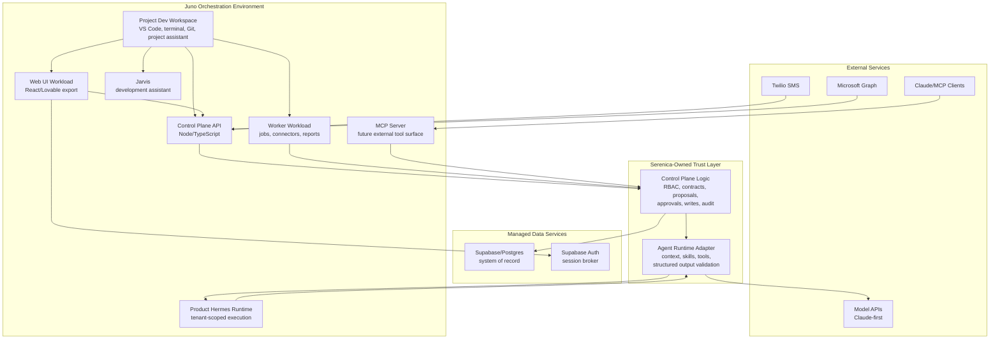

# Juno Platform Pilot Plan

**Audience:** Juno Innovations team and Serenica CRM Agent project collaborators
**Date:** 2026-06-06
**Status:** Draft for Monday outreach

## Summary

Serenica CRM Agent is a contract-first CRM agent platform for small, relationship-heavy businesses that already run much of their workflow through spreadsheets, Microsoft 365, email, and text messaging. Clients bring their Excel-style workbooks; Serenica turns those workbooks into governed semantic contracts and lets users interact with the CRM through web, SMS, email, Excel, and Claude/MCP.

The goal of this pilot is to build Serenica on Juno as a real agentic SaaS use case: a multi-service application with a web UI, a control-plane backend, connector workers, a Dockerized Hermes runtime, Supabase/Postgres as system of record, and project-scoped development agents. Juno would be the preferred orchestration and deployment environment, while Serenica keeps its application logic, trust model, database authority, and compliance packet in its own repo.

## Why Juno Is Interesting For This Project

This project has already crossed the line where a frontend-only or local-only workflow is enough. The application needs multiple long-running and event-driven services:

- A web/PWA interface for records, contract review, integration setup, approvals, audits, and admin.
- A Node/TypeScript control plane that owns tenant routing, RBAC, connector verification, proposals, approvals, writes, audit logging, and usage tracking.
- Background workers for inbound SMS/email processing, weekly reports, workbook processing, and future Microsoft Graph events.
- A Dockerized Hermes runtime used behind a control-plane adapter.
- A future MCP server so Claude or other MCP clients can call controlled tools.
- Preview and production links that can be shared with clients without hand-building deployment infrastructure.

Juno appears well matched to the missing layer: containerized workloads, browser-based development environments, Git-connected project workspaces, runtime templates, scaling, and direct support while the developer-oriented platform workflow is still being shaped.

## Intended Juno Usage

### 1. Development Environment

Use Juno as a cloud development workspace for the Serenica repo:

- Browser-accessible VS Code or equivalent.
- Terminal access with Node, pnpm, Docker/runtime tools as needed.
- GitHub access through normal SSH/token/OAuth workflow.
- Optional internal Git/Gitea-style sandbox before mirroring to GitHub.
- Shared project storage for source, generated artifacts, and agent-created skill files.
- A project-scoped development assistant (Jarvis, a Hermes instance configured as a dev tool) for development help.

Jarvis should be able to read the ADRs, PRD, research docs, and architecture notes. Its job is to help build the product, maintain docs, propose tasks, and preserve project memory. It is not the same thing as the productized tenant-facing runtime.

### 2. Application Workloads

Run the application as normal containers managed through Juno workload templates:

| Workload | Purpose | Likely Stack |
| --- | --- | --- |
| Web UI | User-facing CRM, contract review, admin, approvals, audit views | React/Vite or Lovable-exported React |
| Control Plane API | Trust layer and only writer | Node/TypeScript |
| Worker | Async jobs, reports, connector processing, sync tasks | Node/TypeScript |
| Hermes Runtime | Agent execution behind adapter | Dockerized Python/Hermes |
| MCP Server | External Claude/MCP tool surface | Node/TypeScript, possibly same API initially |

Each workload should be configured with normal build commands, run commands, ports, environment variables, and health checks. The desired outcome is that Juno handles the container/orchestration mechanics while the repo remains portable.

### 3. External Services

The first prototype can still use managed services where that reduces complexity:

- **Supabase/Postgres:** system of record for tenants, users, roles, contracts, records, source messages, proposals, audit events, and sync state.
- **Supabase Auth:** auth/session broker for web users, with Microsoft/Google/email providers as needed.
- **Twilio:** SMS webhook and outbound messaging.
- **Microsoft Graph:** optional future connector for OneDrive, SharePoint, Excel, Outlook, and webhooks.
- **Model APIs:** Claude-first initially, with a provider seam for alternatives.

Juno-hosted workloads should talk to these services through environment variables and secrets. Later, if client-hosted or self-hosted deployments become important, Juno may also become the platform for hosting Postgres/Supabase-style infrastructure.

## The Two Hermes Roles

This pilot has two separate uses of Hermes, and they carry different names so they are never confused.

### Jarvis, the development assistant

Jarvis is the development assistant for building Serenica, a Hermes instance configured as a dev tool. It can be persistent and project-aware. It can read the repo, ADRs, PRD, research docs, transcripts, and implementation notes. It can help write tickets, generate code, explain architecture, maintain documentation, and create project-specific skills.

Jarvis is part of the development workflow. It is scoped to this project and is not client-facing product behavior.

### The Hermes product runtime

This is the Hermes runtime used by Serenica itself. It is invoked by the control plane to process tenant-scoped CRM tasks:

- Parse an inbound SMS or email.
- Interpret a requested CRM update.
- Use the published workbook-derived contract.
- Produce a structured proposal or answer.
- Return provenance and tool traces.

The productized runtime does not directly write CRM records. The Serenica control plane validates the output, applies confirmation/auto-apply policy, writes through the backend, and records the audit trail.

## Current High-Level Architecture

## First Pilot Milestone

The first Juno milestone should be small and concrete:

1. Launch a Juno development workspace for the Serenica repo.
2. Run the web UI workload from the repo.
3. Run the control-plane API workload from the repo.
4. Connect the API to managed Supabase through environment variables.
5. Run a Dockerized Hermes runtime workload.
6. Send one test CRM instruction through the API to Hermes.
7. Receive a structured proposal back from Hermes.
8. Store that proposal and its provenance in Supabase.
9. Expose a preview link for the web UI and API.
10. Document the exact workload templates and env vars used.

This does not need to prove the whole product. It needs to prove the platform shape: multiple containers, managed secrets, Supabase connectivity, Hermes runtime invocation, and previewable deployment.

## Questions For Juno

1. What is the recommended workflow for a repo with multiple services: web, API, worker, Hermes runtime, and MCP server?
2. Should each service be a separate workload template, or should some be bundled during early development?
3. How should secrets be managed for Supabase, Twilio, Microsoft Graph, Anthropic, and GitHub?
4. What is the cleanest way to separate Jarvis (the project-scoped development assistant) from the productized tenant-facing Hermes runtime?
5. Can product workloads scale to zero? If so, which workloads should not scale to zero because of latency or webhook reliability?
6. What platform-level audit logs, access controls, network controls, backups, and security evidence can Juno provide for Serenica's client security packet?
7. What would the eventual pricing/cost model look like for a small-client SaaS trying to stay under roughly $40 per seat-equivalent?
8. How portable are the resulting workload definitions if Serenica later needs to run outside Juno?

## Success Criteria

The pilot is successful if Juno makes the real architecture easier to build without hiding the important boundaries:

- The developer can work productively in the Juno development environment.
- The repo remains a normal portable codebase.
- Web/API/worker/Hermes workloads can run from the same repo.
- The control plane remains the only writer.
- Supabase remains the system of record unless deliberately changed.
- The Hermes product runtime stays separate from Jarvis, the development assistant.
- The deployment story becomes easier to explain to clients and easier to support.
- Juno can contribute evidence to the security packet rather than creating an unexplained black box.

## Near-Term Ask

For Monday, the useful next step is a supported onboarding session focused on this exact use case:

- Create or connect the Serenica repo.
- Launch the developer workspace.
- Define the first web/API/Hermes workloads.
- Confirm how secrets and environment variables should be handled.
- Identify what Juno plugin or workload template work would make this easier.
- Produce a repeatable setup note that becomes part of the project docs.
