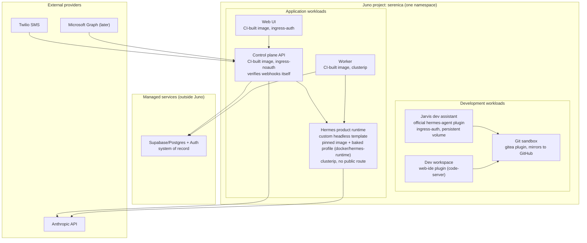

# Juno Platform Pilot Plan

> **Status:** canonical · **Last reviewed:** 2026-06-10

**Audience:** the Juno Innovations team and Serenica Digital project collaborators. This is the scope document the June 5 meeting asked for, and the working agenda for the onboarding session. It is written in Juno's own platform vocabulary (projects, workload templates, Terra Sources, plugins, bundles) so the mapping is direct. Platform facts below were verified against the public juno-fx repos and docs on 2026-06-10; items the public record cannot settle are marked as onboarding questions, since the June 5 meeting was clear that the docs trail the platform. The deeper research record is [docs/research/juno-hermes-deployment-research.md](../research/juno-hermes-deployment-research.md).

## Summary

**Cormac** (working name) is Serenica's product: a contract-first CRM agent platform for small, relationship-heavy businesses that run on spreadsheets, Microsoft 365, email, and text. Clients bring their Excel workbooks; Cormac lifts each into a governed, versioned semantic contract and operates on it through an agent reachable over web, SMS, email, Excel, and Claude/MCP.

The pilot goal: build and run Cormac on Juno as a real agentic SaaS use case. A multi-service containerized application (web UI, control-plane API, worker, a Dockerized Hermes runtime), managed Supabase/Postgres as the external system of record, and a project-scoped development environment with a dev-assistant agent. Juno is the orchestration and deployment layer; Cormac's application logic, trust model, database authority, and compliance packet stay in its own repo, and every service stays a portable container.

## What exists today (what the pilot deploys)

This is not a greenfield. The repo is a pnpm monorepo of normal containers, already running end to end locally:

- `apps/web`: minimal React/Vite web surface.
- `apps/api`: the control plane (Node/TypeScript, Fastify). The trust layer and the only writer of business records. Verifies Supabase JWTs, enforces RBAC, runs the proposal/confirmation/audit pipeline, and serves the agent runtime's tool surface over MCP at `/mcp` (workspace-scoped bearer token; the runtime's only reach into data).
- `apps/worker`: a minimal long-running job container (health endpoint today; the weekly change report and inbound connector processors land here).
- The agent runtime: real Hermes (`nousresearch/hermes-agent`, pinned version), configured by a profile versioned in `docker/hermes-runtime/`: headless API server only, messaging gateways off, memory off, tools allowlisted to the control plane's MCP endpoints, no database credentials. The current work increment lands this in the local stack, so the runtime arrives at Juno already proven. (`services/runtime-stub` remains in the repo as a test fixture only; it no longer runs in the stack.)
- `docker/`: the Dockerfiles for every service, the Hermes profile, and `compose.yaml`, which runs the whole stack locally.
- `supabase/migrations`: app-owned schema, RLS, append-only audit. Canonical state lives in managed Supabase, outside Juno.

The walking skeleton (a natural-language update going capture, propose, validate, confirm, write, audit) runs against real Postgres with CI checks including a cross-tenant isolation test.

## Intended shape on Juno

One Juno project (one namespace) named `serenica`, holding development workloads and application workloads side by side.

The translation rule is mechanical. `docker/compose.yaml` is local-only orchestration and never ships; each compose service becomes one Juno workload running the same image. Compose-network DNS (`http://api:8088`) becomes cluster DNS inside the namespace; `.env` values become per-workload env vars and Kubernetes Secrets. A Terra bundle grouping the workload templates is the platform analog of the compose file.

The application workloads, end to end from repo to cluster:

| Service | Repo source | Build recipe | Local compose service (port) | Published image | Juno workload (network mode) |
| --- | --- | --- | --- | --- | --- |
| Web UI | `apps/web` | `docker/Dockerfile.web` | `web` (5174) | `ghcr.io/serenica-digital/web` | Image workload, `ingress-auth` (or `ingress-noauth` for client previews); the shareable preview link |
| Control plane API | `apps/api` | `docker/Dockerfile.node` | `api` (8088) | `ghcr.io/serenica-digital/api` | Image workload, `ingress-noauth`: public webhook routes (Twilio, later Microsoft Graph) with in-app signature verification; sole holder of the Supabase service key; serves the runtime's MCP tools at `/mcp` |
| Worker | `apps/worker` | `docker/Dockerfile.node` | `worker` (8070) | `ghcr.io/serenica-digital/worker` | Image workload, `clusterip`; no inbound traffic at all |
| Hermes product runtime | upstream `nousresearch/hermes-agent` (pinned) + profile in `docker/hermes-runtime/` | `docker/Dockerfile.hermes` (bakes the profile; secrets stay env-injected) | `hermes` (8642) | `ghcr.io/serenica-digital/hermes-runtime` | Custom workload template, `clusterip`: never publicly routable, called only by the control plane, tools only via the control plane's MCP surface, no database credentials, memory off, stateless per task |
| Excel pane assets (planned; gated on the ADR-028 GO/NO-GO) | `apps/addin` (planned) | static-server Dockerfile (planned) | none yet | `ghcr.io/serenica-digital/addin` | Image workload, `ingress-noauth`: a pure static file server for the task pane's web assets. Office.js itself runs in Excel's webview on the client machine, never here. No secrets, no database access. Must be publicly reachable (Excel loads it directly), must NOT send `X-Frame-Options: SAMEORIGIN`, and needs a stable custom domain because the add-in manifest pins the source URL effectively permanently (see onboarding question 12) |
| System of record | `supabase/migrations` (schema only) | none | Supabase CLI stack beside compose | none | **Not a workload.** Managed Supabase/Postgres outside Juno; every workload reaches it over the network |

The development workloads are official plugins used as shipped:

| Workload | Juno plugin | Network mode | Notes |
| --- | --- | --- | --- |
| Jarvis (dev assistant) | Official `hermes-agent` plugin | `ingress-auth` | Persistent and project-aware; developer tooling only, never touches client data |
| Dev workspace | `web-ide` (code-server) plugin | `ingress-auth` | Needs Node 22 + pnpm; Docker availability is an onboarding question |
| Git sandbox | Official `gitea` plugin | `ingress-auth` | Agent sandbox repos, mirrored to GitHub on approval |

The eventual external Claude/MCP connector is a later surface on the control plane API (an adapter over the same agent pipeline, per ADR-007), not a separate service; it adds no workload to this table.

A note on the build path: the `runtime-js`/`runtime-python` plugins on the public `556-runtime-environments` branch (PR #557) clone a repo and run a build command per workload, which fits single-package repos. Ours is a pnpm monorepo with workspace dependencies and a build order, so the app services deploy as CI-built images from the Dockerfiles already in the repo, and the runtime plugins remain attractive for quick one-off previews. What we want from PR #557 either way is its `network_mode` select (`ingress-auth`, `ingress-noauth`, `clusterip`, `nodeport`); whether the pilot cluster supports those modes for image workloads is the first onboarding question.

Trust rules survive the move unchanged: the control plane is the only writer; the product runtime has no public route and no database credentials; surfaces and webhooks all enter through the control plane, which verifies them in-app rather than relying on platform auth.

## The two Hermes roles

Same upstream software, two trust levels, two workloads, separate secrets and volumes (full reasoning in ADR-017):

- **Jarvis** is the development assistant: persistent, project-aware, reads the repo and docs, helps build Cormac. The official `hermes-agent` plugin already matches this shape (interactive gateway, dashboard, terminal, durable volume) and can likely be used as-is.
- **The Hermes product runtime** is the tenant-facing executor: headless API server only, messaging gateways off, persistent memory off, fresh stateless session per task, invoked exclusively by the control-plane adapter. Its tools are MCP endpoints served by the control plane and allowlisted per agent role, so every action passes through our validation and lands as a held proposal, never a direct write. Configuration is versioned in-repo at `docker/hermes-runtime/` and baked into the pinned `hermes-runtime` image; secrets are env-injected at deploy. We recycle these workers on a schedule (a known upstream memory leak), which is one of the onboarding questions below.

## First pilot milestone

Small and concrete; this doubles as the deployment half of our runtime de-risk spike (ADR-017).

1. Create the `serenica` project; launch the dev workspace and confirm the normal `pnpm` workflow and GitHub access.
2. Register the Terra Source carrying the runtime plugins; confirm `network_mode` options on the pilot cluster.
3. Launch web, API, and worker as CI-built image workloads; wire secrets/env to managed Supabase.
4. Deploy the Hermes product runtime workload (the baked `hermes-runtime` image, `clusterip`).
5. Run the walking-skeleton thread end to end on Juno: a web message becomes a held proposal, approval writes the record and the audit event in Supabase.
6. Expose a preview link for the web UI; confirm the API's public URL shape and stability for future Twilio webhooks.
7. Finalize the repeatable setup note: the image list, per-workload env inventory, and the managed-database bootstrap are already drafted in [deployment-setup.md](deployment-setup.md); the session fills in whatever the cluster changes.

## Onboarding session agenda (the open questions)

1. **Runtime plugins:** is the `556-runtime-environments` branch (PR #557) deployable on the pilot cluster, and is `network_mode: clusterip` the supported pattern for a workload with no public route?
2. **Autoscaling and scale-to-zero:** the June 5 demo described traffic-based horizontal scaling, scale-to-zero, and auto-update on code change for runtime workloads. How do these work, and which workload types do they apply to?
3. **Secrets:** what is the actual mechanism on the pilot cluster for injecting secrets (Supabase service key, Anthropic key, Twilio, GitHub) into specific workloads, and who can read them back?
4. **Webhook URL stability:** is the cluster hostname stable across platform updates, so a Twilio webhook URL set once keeps working?
5. **Per-route auth:** auth appears to be per-workload. Is there a way to gate some routes of one workload behind platform auth while leaving webhook paths public, or do we split workloads (our current plan)?
6. **Scheduled restarts:** any platform pattern for recycling a workload on a schedule or after N requests? We need this for the Hermes runtime regardless of the upstream fix timeline.
7. **Dev workspace Docker:** can the workspace run Docker (socket mount or DinD)? The Supabase CLI's local stack needs it; if not, we develop against a shared dev database instead.
8. **Shared storage:** what backs the shared mounts on the pilot cluster (EFS/NFS), and can multiple workloads mount one workspace volume?
9. **Observability and audit:** what logs, metrics, and platform audit records can we access, and what can be exported? Relevant to our client-facing security packet.
10. **Security evidence in writing:** our product ships with a compliance packet, and its platform-hosting section needs written statements we can cite: the workload-to-workload encryption model (the security page says mTLS; we want the concrete mechanism), namespace isolation, backup/restore, and any certification roadmap.
11. **Pricing shape, later:** deferred by agreement until after discovery. Flagging the constraint early: the product targets small firms and needs hosting economics compatible with a sub-$40 per-seat-equivalent price.
12. **Custom domains with TLS on a workload:** can a specific workload be served under a stable custom domain we own (for example `pane.<product-domain>`), with certificate management? This is stricter than question 4's webhook stability: the planned Excel task-pane workload's domain gets pinned into the Office add-in manifest, which propagates to client machines slowly and is effectively permanent. A Juno-generated cluster hostname is not sufficient for that one workload; if custom domains are not supportable, the pane's static assets move to a CDN while everything else stays on Juno.

## Success criteria

- The developer works productively in the Juno workspace, and the repo remains a normal portable codebase.
- Web, API, worker, and the Hermes runtime all run from this repo as workloads, with secrets managed sanely.
- The control plane remains the only writer; the product runtime has no public route and no database credentials; managed Supabase remains the system of record.
- Jarvis and the product runtime stay cleanly separated.
- Preview links work for client review, and the webhook URL story holds for SMS.
- The setup is reproducible from a written note, and Juno can contribute written evidence to the security packet rather than being a black box in it.

## Near-term ask

A supported onboarding session focused on this exact stack: create the project, launch the workspace, register the runtime-plugin Source, define the first workloads (web, API, Hermes runtime), settle the secrets mechanism, and walk the milestone list above as far as the session allows. We bring a working system and a written agenda; the output we want is a repeatable configuration and a list of anything the platform needs that we can feed back as pilot users.
