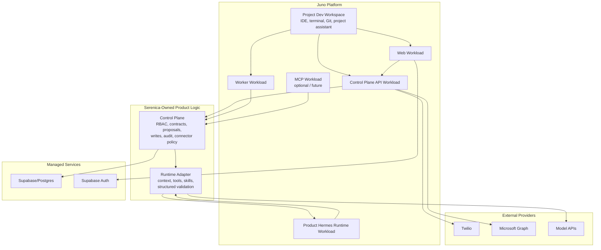

# Juno as the Orchestration Platform: Evaluation and Pilot Fit

Status: research / decision-support
Date reviewed: June 9, 2026 (spike list amended; first reviewed June 6, 2026)
Decision impact: supports ADR-017, "Use Juno as the preferred orchestration platform for the prototype"

## Why This Matters

Direct relevance: 9/10. Serenica CRM Agent needs more than a frontend host: it needs containerized web/API/worker services, webhook handling, a Dockerized Hermes runtime, optional MCP, managed secrets, preview links, and a development workflow that does not force us to become Kubernetes/AWS specialists before the product has proven itself. Juno may be the missing deployment and development layer, especially because the Juno team is offering direct pilot support and is actively exploring Hermes/Claude-style developer workflows.

The main caveat is that the public Juno documentation is still oriented around enterprise compute orchestration, GPU utilization, air-gapped environments, and Kubernetes infrastructure. The developer-pilot story comes mostly from the June 5 meeting notes, not from fully mature public docs. That makes this a strong opportunity, but not yet a fully de-risked platform decision.

## One-Paragraph Take

Juno is a strong candidate to be Serenica's preferred prototype orchestration platform, not its product brain. The product should remain a portable monorepo of normal containers, with Supabase/Postgres as the system of record and the Serenica control plane as the only writer. Juno's likely role is to provide browser-based development workspaces, app/runtime workload orchestration, previewable deployments, and a practical place to run both the development assistant (Jarvis) and the productized Hermes runtime. The decision should be validated with a short deployment spike before Juno becomes a hard dependency.

## What Juno Publicly Claims

### Platform Shape

Juno's public site describes Orion as a platform for deploying, scaling, and automating compute workloads, with documentation that includes quickstarts, API reference, and deployment guides. The docs page positions the platform around containerized workloads, scaling, automation, and deployment across Linux/Kubernetes-style environments.

Official sources:

- Juno docs landing page: <https://www.juno-innovations.com/docs>
- Orion docs: <https://juno-fx.github.io/Orion-Documentation/latest/>

### Orion

Orion is described as a unified compute plane that orchestrates infrastructure across bare metal, Kubernetes, cloud, hybrid, and edge-style deployments. The public docs emphasize enterprise compute, resource optimization, dynamic allocation, workload portability, and API integration. For Serenica, the relevant claim is not the GPU utilization story; it is the container-native orchestration layer and the idea that workloads can move between deployment environments.

Source: <https://juno-fx.github.io/Orion-Documentation/latest/>

### Quick Start and Deployment Model

The Orion quick start says installation is meant to be easy through a "OneClick" installer or Helm chart. It lists Linux/systemd prerequisites, DNS requirements, k3s details, and deployment targets. It also notes that Juno's internal production cloud runs on Amazon EKS and that local development can use kind clusters.

This matters because the platform is not a proprietary black box in the ordinary SaaS sense. It sits on recognizable infrastructure primitives: Kubernetes/k3s, Helm, containers, DNS, and workload configuration. That supports the portability goal, but it also means the team must still understand enough about containers and environment configuration to operate responsibly.

Source: <https://juno-fx.github.io/Orion-Documentation/latest/installation/quick-start/>

### Genesis, Hubble, and Workload Templates

The workload docs describe Genesis as the management surface for workload templates and Hubble as the namespace/project portal for deployed Orion projects. Workload templates can define schema fields, environment variables, group/project assignment, and template lifecycle actions like edit, duplicate, upgrade, and deprecation.

This maps directly to Serenica's needs: web, API, worker, Hermes runtime, and future MCP server can each become workload templates or related app workloads. The important design question is whether those services should be separate workload templates from day one or bundled during the first spike.

Source: <https://juno-fx.github.io/Orion-Documentation/latest/genesis/workloads/>

### Terra

Terra is Juno's plugin and workload-deployment layer. Public docs describe Terra repositories as Git repositories containing plugins and bundles. Plugins are loaded from a `plugins/` directory and require a `terra.yaml`; bundles group multiple plugins and configurations together.

This is relevant if Serenica eventually needs a custom "Serenica development environment" or "Serenica app stack" plugin: for example, a bundle that launches web, API, worker, Hermes runtime, and maybe a project-scoped development assistant in one repeatable setup.

Source: <https://juno-fx.github.io/Terra-Official-Plugins/repositories/>

### Helios

Helios is described as a containerized workstation image for browser-based developer or user environments. The public docs emphasize flexible, extendable workstations that can run on Juno Orion or standalone.

For Serenica, Helios matters because the developer's daily workflow may move from local VS Code plus terminal into a cloud development workspace with project tools, repo access, and agent assistants.

Source: <https://juno-fx.github.io/Helios/>

### Auth and Security Claims

The Orion auth docs describe Genesis as the primary access point for Juno products, using NextAuth.js and supporting Google, AWS Cognito, basic auth for local development/testing, and AD/LDAP. The docs warn that basic auth is not appropriate for production. Juno's security page claims namespace isolation, mTLS workload-to-workload communication, RBAC and audit logging, secret-management integrations, and air-gapped deployment support.

For Serenica, this is useful but incomplete. Juno's platform controls can help the hosting/security story, but they do not replace Serenica's own application-level auth, tenant isolation, audit trail, contract validation, or control-plane write rules.

Sources:

- Auth docs: <https://juno-fx.github.io/Orion-Documentation/latest/installation/install/auth/>
- Security page: <https://www.juno-innovations.com/security>

## What The June 5 Meeting Adds

Internal source: the June 5 Juno meeting notes (private dev notes, `docs/notes/convos/Juno/6-5-2026.md`).

The meeting described a developer-pilot direction that is more specific and more relevant than the public docs:

- Juno is moving beyond enterprise-only positioning and wants early individual developers to test the platform.
- We would start on a Juno AWS development cluster with direct onboarding and support.
- Hubble would be the developer dashboard for launching workloads.
- Genesis would be the admin/configuration surface.
- Workloads could include VS Code/browser IDE, terminals, Git/Gitea, runtime app containers, Hermes, Claude Code/OpenCode-style agents, and project-specific environments.
- Runtime workloads can be configured with repo, branch, build command, run command, port, auth setting, resources, and possibly GPU.
- Juno can expose running apps through links suitable for client review.
- They described shared storage mounts and sandbox Git/Gitea repositories that can later mirror to GitHub.
- They specifically pushed us to look at Hermes and discussed Hermes as both a development assistant and a runtime-like agent component.

This is the real reason Juno is compelling for Serenica. The public platform explains the infrastructure. The meeting explains the developer workflow and the relationship opportunity.

## Fit For Serenica

### Strong Fit

- **Containerized multi-service app.** Serenica already wants a web app, API/control plane, worker, Hermes runtime, and possibly MCP server. Juno is explicitly about deploying and managing workloads.
- **Hermes deployment.** The productized Hermes runtime needs somewhere to run. A Juno workload is a natural home for the runtime as long as the control plane remains the only writer.
- **Development assistant.** A project-scoped Hermes assistant that reads ADRs, PRD, research docs, and implementation notes fits Juno's agentic development-workspace story.
- **Client previews.** Juno's pitch around launching app runtime containers and sharing links directly addresses the handoff/demo problem.
- **AWS path without immediate AWS fluency.** The meeting notes suggest Juno can put us on an AWS development cluster while hiding much of the orchestration complexity.
- **Security packet support.** Juno's security claims could become part of the hosting/platform section of Serenica's security packet, if Juno can provide evidence.

### Partial Fit

- **Supabase.** Juno can host workloads that talk to managed Supabase, and the public site lists Supabase/PostgreSQL among integrations. But that does not mean Supabase auth/database management should move into Juno immediately. Managed Supabase remains simpler for v1 unless self-hosting becomes a requirement.
- **Microsoft/Twilio connectors.** Juno is not where connector business logic should live. It can host the containers that process connector webhooks, but Serenica's control plane should still own verification, policy, writes, and audit.
- **Lovable.** Lovable can still produce the web UI, but Juno is where the exported web app and backend services run. Lovable should not become the integration/control surface.

### Not A Fit

- **Source of truth.** Juno should not own CRM records, schema contracts, proposals, audit events, or tenant state.
- **Product authorization.** Juno platform auth is about accessing Juno/Orion/Genesis/Hubble. Serenica still needs Supabase Auth and control-plane authorization for product users.
- **Agent authority.** Juno can run Hermes, but Juno should not grant Hermes direct write credentials or bypass the control plane.

## The Two Hermes Roles

This research strengthens ADR-017's distinction between two Hermes uses:

| Role | Name | Where it lives | Memory posture | Authority |
| --- | --- | --- | --- | --- |
| Development assistant | Jarvis | Juno dev workspace/workload | Can be persistent and project-aware | Can help code/docs/Git, but only as a developer tool |
| Productized tenant-facing runtime | Hermes runtime | Juno runtime workload behind adapter | Stateless per task where possible | No database write authority; emits proposals/answers to control plane |

Jarvis can integrate with ADRs as project memory. The Hermes product runtime must be isolated, validated, auditable, and governed. The two use the same upstream software but should run as separate workloads, with separate secrets, storage, and skills/memory directories, unless the spike proves a safer pattern.

## Proposed Pilot Architecture

## De-Risk Spike

The first Juno spike should answer whether the platform helps without creating hidden dependency risk.

1. Launch a Juno dev workspace for the Serenica repo.
2. Confirm GitHub access and normal `pnpm` development workflow.
3. Run a basic web workload.
4. Run a basic Node/TypeScript API workload.
5. Connect the API workload to managed Supabase through secrets/env vars.
6. Try the Terra Supabase/Postgres plugin as the dev-workspace database: run the migrations, the seed, and the cross-tenant isolation test against it, and document whether they behave identically to the local CLI stack. Dev and preview data only; canonical state stays in managed Supabase.
7. Run a Dockerized Hermes runtime workload.
8. Invoke Hermes through a control-plane adapter, not directly from the web UI.
9. Process one test CRM instruction into a structured proposal.
10. Store proposal and provenance in Supabase.
11. Expose preview links for web/API.
12. Document the workload templates and env vars.
13. Confirm what platform-level logs, security controls, and secrets mechanisms are available.

Kill or pause conditions:

- Juno cannot run the repo's normal containers without heavy platform-specific rewrites.
- Secrets/environment management is too immature for Supabase, Twilio, Microsoft, and model keys.
- The Hermes product runtime cannot be separated cleanly from Jarvis, the development assistant.
- Preview links or webhook endpoints are unreliable or too hard to reason about.
- The eventual pricing model clearly cannot fit ADR-016's small-client economics.

## Security and Compliance Implications

Juno can strengthen the hosting story if its claims hold up, especially around container isolation, platform audit logs, RBAC, mTLS, and secret-management integration. But Serenica's security packet must distinguish between:

- **Juno/platform controls:** cluster access, workload isolation, platform auth, platform audit logs, secrets injection, networking, backup/restore, incident response.
- **Serenica/application controls:** Supabase Auth, product RBAC, tenant isolation, contract validation, proposal/approval rules, audit events, connector verification, AI data handling, weekly reports, and user-facing permissions.

Enterprise IT will ask for both. Juno can help with the first category; Serenica still owns the second.

Open evidence asks for Juno:

- SOC 2 / ISO status or roadmap, if any.
- Written description of platform audit logs.
- Secrets-management architecture for pilot workloads.
- Backup and restore process for Juno-hosted workloads and shared storage.
- Network isolation model between workloads/projects.
- Data residency and AWS region options.
- Production support and incident escalation path.

## Recommendation

Proceed with Juno as the preferred prototype orchestration platform, with a portability guardrail. This is not a decision to make Juno the product's source of truth or authority layer. It is a decision to use Juno to run the actual services we already know we need, while preserving the ability to move those services to another container platform later.

The right near-term posture is:

- Build the repo as normal portable containers.
- Use managed Supabase for v1 unless self-hosting becomes necessary.
- Put connector logic in the control plane, not in Lovable or Juno-specific integrations.
- Run productized Hermes as a Juno workload behind the adapter.
- Run a separate project-scoped Hermes assistant for development.
- Ask Juno to help define a repeatable workload template or bundle for this stack.
- Treat the first onboarding session as a deployment spike, not just a tutorial.

## Open Questions

- What exact workload templates should exist for web, API, worker, Hermes runtime, and MCP?
- Does Juno support the right secret handling for production-ish API keys from day one?
- How should project-scoped Hermes memory/skills be stored and versioned?
- Can Juno provide stable public webhook URLs for Twilio and future Microsoft Graph events?
- Which workloads can scale to zero, and which must remain warm?
- How do volumes and persistence behave across workload restarts for stateful dev workloads such as the Supabase plugin? This is the maturity signal that would ever justify revisiting where production state lives.
- Can the productized Hermes runtime run isolated per tenant or per workspace when needed?
- What is Juno's eventual pricing model for an early developer or small SaaS workload?
- What security/compliance evidence can Juno provide for client-facing review?

## Sources

Official Juno sources:

- Juno docs landing page: <https://www.juno-innovations.com/docs>
- Orion documentation: <https://juno-fx.github.io/Orion-Documentation/latest/>
- Orion quick start: <https://juno-fx.github.io/Orion-Documentation/latest/installation/quick-start/>
- Orion workload management: <https://juno-fx.github.io/Orion-Documentation/latest/genesis/workloads/>
- Orion authentication: <https://juno-fx.github.io/Orion-Documentation/latest/installation/install/auth/>
- Juno security page: <https://www.juno-innovations.com/security>
- Terra official plugins: <https://juno-fx.github.io/Terra-Official-Plugins/>
- Terra repositories: <https://juno-fx.github.io/Terra-Official-Plugins/repositories/>
- Helios documentation: <https://juno-fx.github.io/Helios/>

Internal sources:

- June 5 Juno meeting notes (private dev notes): `docs/notes/convos/Juno/6-5-2026.md`
- ADR-017: [docs/adr/017-juno-as-preferred-orchestration-platform.md](../adr/017-juno-as-preferred-orchestration-platform.md)
- Juno pilot PRD: [docs/prd/juno-platform-pilot.md](../prd/juno-platform-pilot.md)
