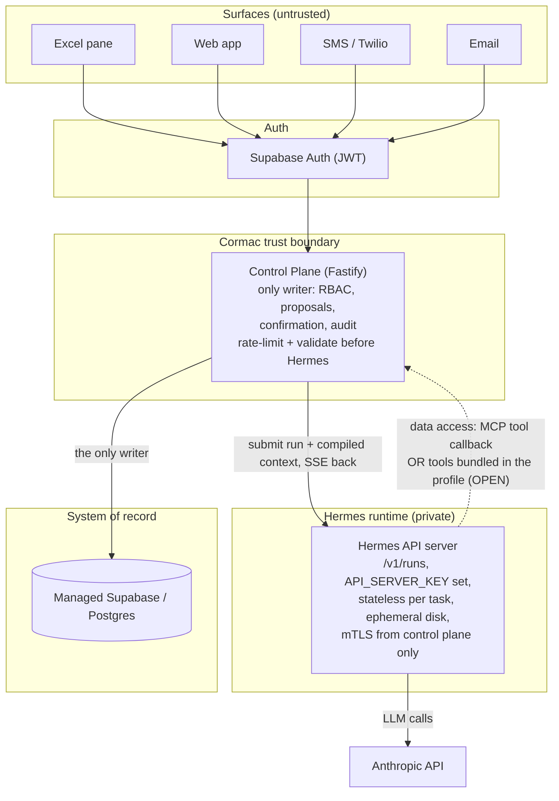
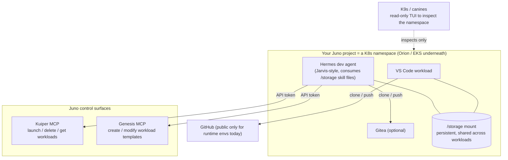

## Cormac

```mermaid
flowchart TB
  subgraph surfaces["Surfaces (untrusted)"]
    excel["Excel pane"]
    web["Web app"]
    sms["SMS / Twilio"]
    email["Email"]
  end

  subgraph auth["Auth"]
    supaAuth["Supabase Auth (JWT)"]
  end

  subgraph ours["Cormac trust boundary"]
    cp["Control Plane (Fastify)<br/>only writer: RBAC, proposals,<br/>confirmation, audit<br/>rate-limit + validate before Hermes"]
  end

  subgraph runtime["Hermes runtime (private)"]
    hermes["Hermes API server<br/>/v1/runs, API_SERVER_KEY set,<br/>stateless per task, ephemeral disk,<br/>mTLS from control plane only"]
  end

  subgraph data["System of record"]
    db[("Managed Supabase / Postgres")]
  end

  model["Anthropic API"]

  excel & web & sms & email --> supaAuth
  supaAuth --> cp
  cp -->|"submit run + compiled context, SSE back"| hermes
  hermes -->|"LLM calls"| model
  hermes -.->|"data access: MCP tool callback<br/>OR tools bundled in the profile (OPEN)"| cp
  cp -->|"the only writer"| db
```

## Jarvis

```mermaid
flowchart TB
  subgraph k8s["Your Juno project = a K8s namespace (Orion / EKS underneath)"]
    vscode["VS Code workload"]
    hdev["Hermes dev agent<br/>(Jarvis-style, consumes /storage skill files)"]
    gitea["Gitea (optional)"]
    storage[("/storage mount<br/>persistent, shared across workloads")]
  end

  subgraph juno["Juno control surfaces"]
    kuiper["Kuiper MCP<br/>launch / delete / get workloads"]
    genesisMcp["Genesis MCP<br/>create / modify workload templates"]
  end

  github["GitHub (public only for runtime envs today)"]
  k9s["K9s / canines<br/>read-only TUI to inspect the namespace"]

  vscode --- storage
  hdev --- storage
  hdev -->|"API token"| kuiper
  hdev -->|"API token"| genesisMcp
  vscode -->|"clone / push"| github
  hdev -->|"clone / push"| gitea
  k9s -. inspects only .-> k8s
```